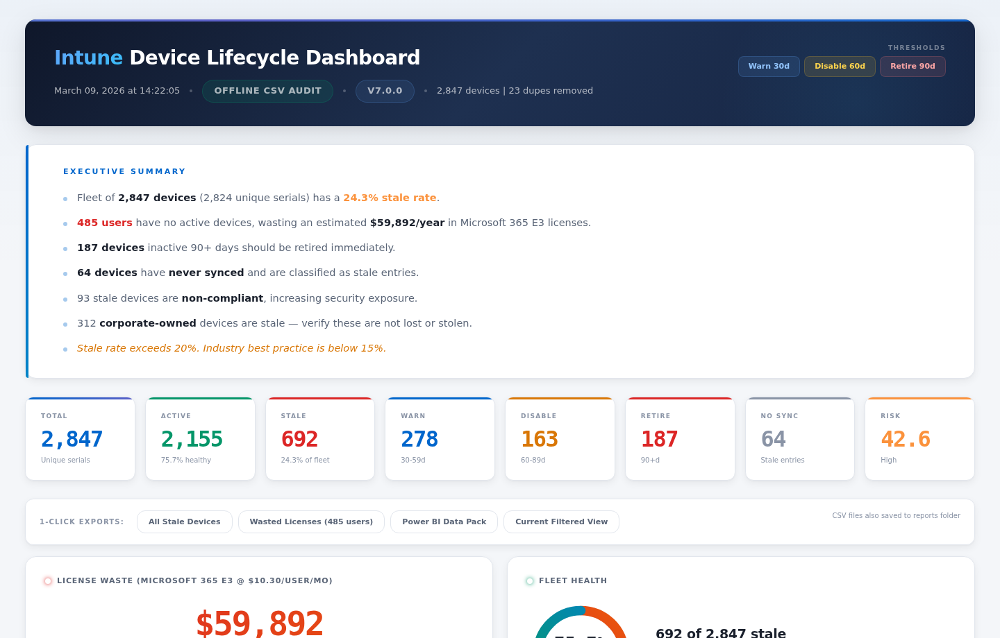
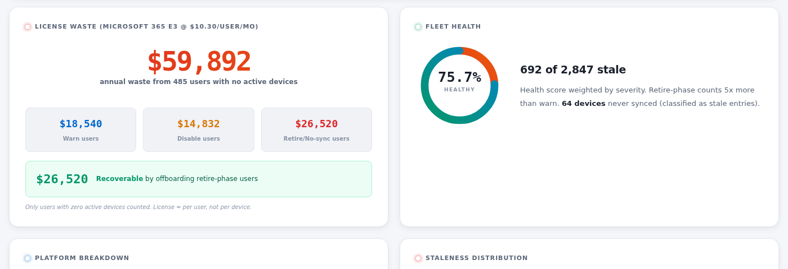
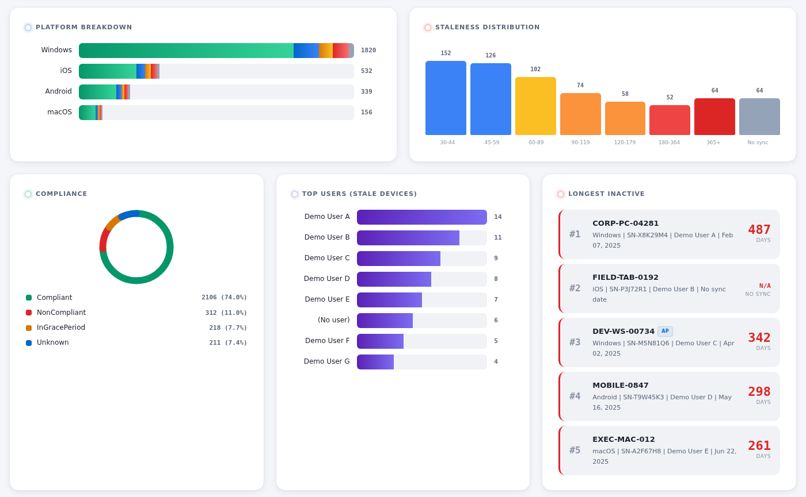
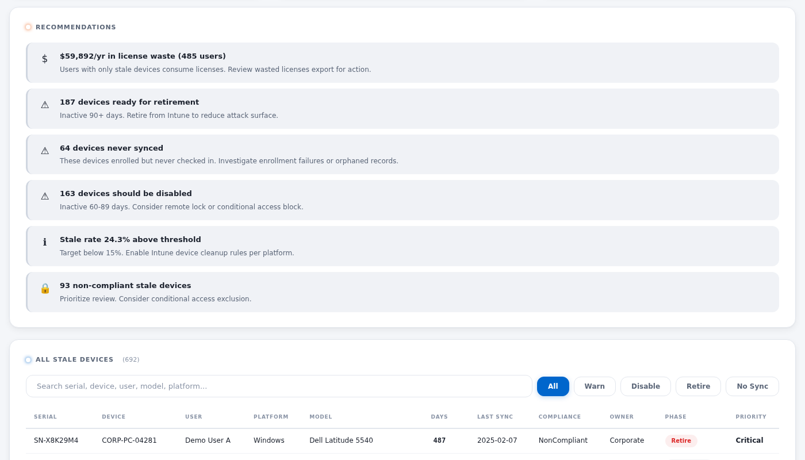

# 🖥️ Intune Device Lifecycle Dashboard v7.0

**Production-ready offline stale device analysis with license cost impact for Microsoft Intune**

[](https://docs.microsoft.com/powershell/)
[](LICENSE)
[](https://www.microsoft.com/intune)
[](https://intune.microsoft.com)

---

> **Turn a simple Intune CSV export into an executive-grade interactive dashboard — in 30 seconds.**
> 
> No Graph API. No admin consent. No app registration. No modules to install. Just PowerShell + your CSV.

---



## 🎯 The Problem

Most organizations managing 1,000+ devices are **losing $30K–$100K/year** on Microsoft 365 licenses tied to users whose devices haven't checked in for months — and nobody's tracking it.

Devices go stale silently. Users leave, hardware sits in drawers, enrollment records pile up. Meanwhile, every ghost device is tied to a license your org is paying for.

## ✨ What This Tool Does

A single PowerShell script that works **entirely offline** from a CSV exported from the Intune portal:

| Feature | Description |
|---------|-------------|
| **Lifecycle Classification** | Categorizes every device into Active / Warn / Disable / Retire / Stale Entry phases |
| **License Cost Calculator** | Calculates waste **per user** (not per device) — because that's how M365 licensing works |
| **Serial-Based Deduplication** | Removes duplicate entries, keeping the most recent sync per serial number |
| **Stale Entry Detection** | Devices that never synced are classified separately as "Stale entry" with Critical priority |
| **Interactive Dashboard** | Premium HTML dashboard with charts, search, sort, filter, and pagination |
| **1-Click Exports** | Stale devices CSV, Wasted licenses CSV, Power BI data pack, filtered view — all from the dashboard |
| **Executive Summary** | CTO-ready brief with dollar impact, risk score, and prioritized recommendations |
| **Risk Scoring** | Weighted severity model (retire=5x, disable=3x, warn=1x) |
| **Progress Bar** | Real-time 5-phase progress indicator with completion percentage |
| **High Performance** | Uses .NET Generic Lists — processes 50,000+ devices in under 30 seconds |

## 📸 Dashboard Screenshots

### License Cost Waste + Fleet Health


### Platform Breakdown, Staleness Distribution, Compliance & Top Inactive


### Recommendations + Searchable Device Table


## 🚀 Quick Start (3 Steps, 30 Seconds)

### Step 1: Export your devices
1. Open [https://intune.microsoft.com](https://intune.microsoft.com)
2. Navigate to **Devices → All devices**
3. Click **Export** → Download the CSV or ZIP file

### Step 2: Run the script
```powershell
.\Invoke-IntuneDeviceLifecycle.ps1 -CsvPath "C:\Downloads\AllDevices.csv"
```

### Step 3: That's it.
The dashboard auto-opens in your browser. Three CSV reports are saved to `.\reports\`:
- `StaleDevices-*.csv` — All stale devices by serial number
- `WastedLicenses-*.csv` — Users with no active devices (license waste)
- `PowerBI-FullFleet-*.csv` — Complete fleet data for Power BI import

## ⚙️ Parameters

| Parameter | Default | Description |
|-----------|---------|-------------|
| `-CsvPath` | *(required)* | Path to CSV or ZIP exported from Intune |
| `-WarnAfterDays` | `30` | Days of inactivity for Warning phase |
| `-DisableAfterDays` | `60` | Days of inactivity for Disable phase |
| `-RetireAfterDays` | `90` | Days of inactivity for Retire phase |
| `-LicenseCostPerUser` | `10.30` | Monthly license cost per user in USD |
| `-LicenseName` | `"Microsoft 365 E3"` | License plan name for display |
| `-ExcludePlatforms` | `@()` | OS platforms to exclude (e.g., `"iOS"`, `"Android"`) |
| `-ExcludeSerials` | `""` | Path to text file of serial numbers to exclude |
| `-ReportPath` | `".\reports"` | Output directory for reports |
| `-NoAutoOpen` | | Don't auto-open dashboard in browser |

## 📋 Usage Examples

```powershell
# Basic — default M365 E3 pricing
.\Invoke-IntuneDeviceLifecycle.ps1 -CsvPath ".\AllDevices.csv"

# M365 E5 pricing
.\Invoke-IntuneDeviceLifecycle.ps1 -CsvPath ".\devices.csv" -LicenseCostPerUser 16.50 -LicenseName "M365 E5"

# Intune standalone pricing
.\Invoke-IntuneDeviceLifecycle.ps1 -CsvPath ".\devices.csv" -LicenseCostPerUser 8.00 -LicenseName "Intune P1"

# Custom thresholds
.\Invoke-IntuneDeviceLifecycle.ps1 -CsvPath ".\devices.csv" -WarnAfterDays 45 -DisableAfterDays 75 -RetireAfterDays 120

# Exclude mobile platforms
.\Invoke-IntuneDeviceLifecycle.ps1 -CsvPath ".\devices.csv" -ExcludePlatforms @("iOS","Android")

# Exclude VIP devices by serial number
.\Invoke-IntuneDeviceLifecycle.ps1 -CsvPath ".\devices.csv" -ExcludeSerials ".\vip-serials.txt"

# ZIP file support (Intune exports as ZIP)
.\Invoke-IntuneDeviceLifecycle.ps1 -CsvPath ".\DeviceExport.zip"
```

## 💰 License Cost Calculation Logic

The license cost calculator is **user-based**, not device-based, because that's how Microsoft 365 licensing works:

1. Maps every device to its user (by UPN)
2. Identifies users whose **ALL** enrolled devices are stale
3. Only these users represent truly wasted licenses
4. If a user has even one active device, their license is **not** counted as waste

This prevents inflated cost estimates that device-based calculations produce.

## 📊 Power BI Integration

The script auto-generates a `PowerBI-FullFleet-*.csv` with structured columns optimized for Power BI:

- Import into Power BI Desktop via **Get Data → Text/CSV**
- All fields included: Serial, Device, User, Platform, Phase, Priority, Compliance, Ownership, License Waste flag
- Ready for slicers, drill-throughs, and DAX measures

## 🔧 Requirements

- **PowerShell 5.1+** (built into Windows 10/11)
- **Intune Admin** role (to export CSV from portal)
- No additional modules, no Graph API, no internet connection needed to run

## 📁 Output Files

Each run generates:

```
.\reports\
├── Dashboard-YYYYMMDD-HHmmss.html      # Interactive HTML dashboard
├── StaleDevices-YYYYMMDD-HHmmss.csv     # Stale device inventory
├── WastedLicenses-YYYYMMDD-HHmmss.csv   # Users with wasted licenses
├── PowerBI-FullFleet-YYYYMMDD-HHmmss.csv # Full fleet for Power BI
└── lifecycle-YYYYMMDD-HHmmss.log        # Execution log
```

## 🏗️ How It Works

```
Phase 1 → Load CSV (supports ZIP)
Phase 2 → Deduplicate by serial number (keeps most recent sync)
Phase 3 → Classify devices into lifecycle phases + calculate costs
Phase 4 → Export CSV reports (stale, licenses, Power BI)
Phase 5 → Generate interactive HTML dashboard
```

**Performance:** Uses `[System.Collections.Generic.List]` instead of PowerShell's `@() +=` pattern, achieving **1400%+ faster** processing on large datasets.

## 🤝 Contributing

Contributions are welcome! Feel free to:
- Report bugs via Issues
- Submit feature requests
- Open Pull Requests

## 📄 License

This project is licensed under the MIT License — see the [LICENSE](LICENSE) file for details.

## ⭐ Star This Repo

If this tool saved your organization time or money, please consider giving it a ⭐ — it helps others discover it.

---

**Built with ❤️ for the Intune community**
